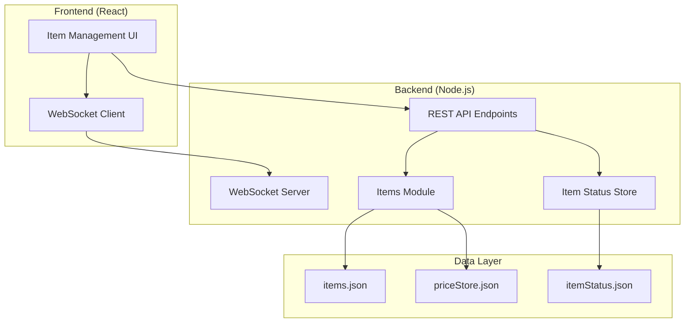

# Design Document: Item Management UI

## Overview

Система управления предметами представляет собой веб-интерфейс для контроля покупки предметов аукционным ботом. Система позволяет пользователям просматривать список отслеживаемых предметов с их иконками и ценами, включать/отключать покупку отдельных предметов, и отслеживать изменения цен в реальном времени.

Система интегрируется в существующий веб-интерфейс бота и использует архитектуру клиент-сервер с WebSocket для обновлений в реальном времени.

## Architecture

### High-Level Architecture



### Component Integration

Система интегрируется в существующую архитектуру следующим образом:

1. **Controller Layer**: Новые API endpoints добавляются в `controller/index.js`
2. **Items Module**: Расширение существующего `agent/botapp/modules/items.js`
3. **Web UI**: Новый React компонент в существующем `controller/webui/index.html`
4. **Real-time Updates**: Использование существующего Socket.IO сервера

## Components and Interfaces

### 1. Backend Components

#### ItemStatusManager
Управляет статусами включения/отключения предметов.

```javascript
class ItemStatusManager {
    constructor(statusFilePath) {
        this.statusFilePath = statusFilePath;
        this.itemStatuses = new Map(); // itemId -> boolean (enabled/disabled)
    }
    
    loadStatuses() {
        // Загружает статусы из JSON файла
    }
    
    saveStatuses() {
        // Сохраняет статусы в JSON файл
    }
    
    setItemStatus(itemId, enabled) {
        // Устанавливает статус предмета
    }
    
    isItemEnabled(itemId) {
        // Проверяет включен ли предмет
    }
    
    getAllStatuses() {
        // Возвращает все статусы
    }
}
```

#### Extended Items Module
Расширение существующего модуля предметов.

```javascript
// Дополнения к agent/botapp/modules/items.js
const ItemStatusManager = require('./itemStatusManager');
const statusManager = new ItemStatusManager('./itemStatus.json');

function getItemsWithStatus() {
    return targetItems.map(item => ({
        ...item,
        enabled: statusManager.isItemEnabled(item.id),
        hasIcon: hasMinecraftIcon(item.name)
    }));
}

function setItemPurchaseStatus(itemId, enabled) {
    statusManager.setItemStatus(itemId, enabled);
    // Emit update через WebSocket
    if (typeof process.send === 'function') {
        process.send({ 
            t: 'itemStatusUpdate', 
            itemId, 
            enabled 
        });
    }
}

function shouldPurchaseItem(item) {
    return statusManager.isItemEnabled(item.id);
}
```

#### API Endpoints
Новые REST API endpoints в `controller/index.js`.

```javascript
// GET /api/items - получить все предметы с статусами и ценами
app.get('/api/items', (req, res) => {
    const items = getItemsWithStatus();
    res.json(items);
});

// POST /api/items/:id/status - изменить статус предмета
app.post('/api/items/:id/status', (req, res) => {
    const { id } = req.params;
    const { enabled } = req.body;
    
    if (typeof enabled !== 'boolean') {
        return res.status(400).json({ error: 'enabled must be boolean' });
    }
    
    setItemPurchaseStatus(id, enabled);
    io.emit('itemStatusChanged', { itemId: id, enabled });
    
    res.json({ success: true });
});

// GET /api/items/icons/:itemName - получить иконку предмета
app.get('/api/items/icons/:itemName', (req, res) => {
    const { itemName } = req.params;
    const iconPath = getMinecraftIconPath(itemName);
    
    if (iconPath && fs.existsSync(iconPath)) {
        res.sendFile(iconPath);
    } else {
        res.sendFile(getDefaultIconPath());
    }
});
```

### 2. Frontend Components

#### ItemManagementPanel
Главный React компонент для управления предметами.

```jsx
function ItemManagementPanel() {
    const [items, setItems] = useState([]);
    const [searchTerm, setSearchTerm] = useState('');
    const [statusFilter, setStatusFilter] = useState('all'); // 'all', 'enabled', 'disabled'
    const [priceUpdates, setPriceUpdates] = useState(new Map());
    
    useEffect(() => {
        loadItems();
        setupWebSocketListeners();
    }, []);
    
    const filteredItems = useMemo(() => {
        return items.filter(item => {
            const matchesSearch = item.displayName.toLowerCase()
                .includes(searchTerm.toLowerCase()) ||
                item.searchKeyword.toLowerCase()
                .includes(searchTerm.toLowerCase());
            
            const matchesStatus = statusFilter === 'all' ||
                (statusFilter === 'enabled' && item.enabled) ||
                (statusFilter === 'disabled' && !item.enabled);
            
            return matchesSearch && matchesStatus;
        });
    }, [items, searchTerm, statusFilter]);
    
    return (
        <div className="panel p-4">
            <ItemFilters 
                searchTerm={searchTerm}
                onSearchChange={setSearchTerm}
                statusFilter={statusFilter}
                onStatusFilterChange={setStatusFilter}
            />
            <ItemGrid 
                items={filteredItems}
                onStatusToggle={handleStatusToggle}
                priceUpdates={priceUpdates}
            />
        </div>
    );
}
```

#### ItemCard
Компонент для отображения отдельного предмета.

```jsx
function ItemCard({ item, onStatusToggle, priceUpdate }) {
    const [isToggling, setIsToggling] = useState(false);
    
    const handleToggle = async () => {
        setIsToggling(true);
        try {
            await onStatusToggle(item.id, !item.enabled);
        } finally {
            setIsToggling(false);
        }
    };
    
    return (
        <div className={`panel p-3 ${item.enabled ? 'border-green-400/30' : 'border-red-400/30'}`}>
            <div className="flex items-center gap-3">
                <ItemIcon itemName={item.name} />
                <div className="flex-1 min-w-0">
                    <div className="font-medium text-white/90 truncate">
                        {item.displayName}
                    </div>
                    <div className="text-xs text-white/60">
                        ID: {item.id}
                    </div>
                </div>
                <StatusToggle 
                    enabled={item.enabled}
                    loading={isToggling}
                    onChange={handleToggle}
                />
            </div>
            
            <PriceDisplay 
                item={item}
                priceUpdate={priceUpdate}
            />
        </div>
    );
}
```

#### ItemIcon
Компонент для отображения иконки предмета.

```jsx
function ItemIcon({ itemName, size = 32 }) {
    const [iconError, setIconError] = useState(false);
    const iconUrl = `/api/items/icons/${encodeURIComponent(itemName)}`;
    
    if (iconError) {
        return (
            <div 
                className="bg-gray-600 rounded flex items-center justify-center text-white/60"
                style={{ width: size, height: size }}
            >
                <svg width={size/2} height={size/2} viewBox="0 0 24 24" fill="currentColor">
                    <path d="M12 2C6.48 2 2 6.48 2 12s4.48 10 10 10 10-4.48 10-10S17.52 2 12 2zm-2 15l-5-5 1.41-1.41L10 14.17l7.59-7.59L19 8l-9 9z"/>
                </svg>
            </div>
        );
    }
    
    return (
         setIconError(true)}
        />
    );
}
```

## Data Models

### Item Data Model
```typescript
interface TargetItem {
    id: string;                    // Уникальный идентификатор
    name: string;                  // Minecraft item name для иконки
    displayName: string;           // Отображаемое название
    searchKeyword: string;         // Ключевое слово для поиска
    absoluteMinUnitPrice: number | null;  // Минимальная цена
    buyPrice: number | null;       // Цена покупки
    sellPrice: number | null;      // Цена продажи
    lastUpdated: Date | null;      // Время последнего обновления
    requiredNbt?: object;          // NBT данные (опционально)
    enabled?: boolean;             // Статус включения (добавляется)
    hasIcon?: boolean;             // Есть ли иконка (добавляется)
}
```

### Item Status Model
```typescript
interface ItemStatus {
    itemId: string;
    enabled: boolean;
    lastModified: Date;
    modifiedBy?: string;  // Для аудита
}
```

### Price Update Model
```typescript
interface PriceUpdate {
    itemId: string;
    oldPrice: number | null;
    newPrice: number | null;
    timestamp: Date;
    changeType: 'increase' | 'decrease' | 'new' | 'removed';
}
```

## Correctness Properties

*A property is a characteristic or behavior that should hold true across all valid executions of a system-essentially, a formal statement about what the system should do. Properties serve as the bridge between human-readable specifications and machine-verifiable correctness guarantees.*

### Property 1: Complete Item Display
*For any* set of target items, when the item management page loads, all items should be displayed with their icon, name, prices, and status
**Validates: Requirements 1.1, 1.2**

### Property 2: Price Data Rendering
*For any* item with available price data, the display should show buyPrice, sellPrice, and last update time formatted with thousand separators
**Validates: Requirements 1.3, 3.5**

### Property 3: Status Toggle Persistence
*For any* item status change, toggling the purchase status should persist the change and be reflected in subsequent system behavior
**Validates: Requirements 2.1, 2.2, 2.3, 2.5**

### Property 4: Visual Status Distinction
*For any* item, enabled and disabled items should have visually distinct styling (different border colors or CSS classes)
**Validates: Requirements 2.4**

### Property 5: Real-time Price Updates
*For any* price change event, the UI should automatically update the displayed prices without requiring page reload
**Validates: Requirements 3.2**

### Property 6: Price Change Highlighting
*For any* price that changes, the system should visually highlight the change for user awareness
**Validates: Requirements 3.3**

### Property 7: Icon Mapping Consistency
*For any* item with a standard Minecraft name, the system should display the corresponding icon, and fallback to default icon for unknown items
**Validates: Requirements 1.5, 6.2, 6.3**

### Property 8: Icon Size Standardization
*For any* displayed item icon, the image should have width and height attributes set to 32 pixels
**Validates: Requirements 6.4**

### Property 9: API Response Structure
*For any* API request to get items, the response should contain all required fields (id, name, displayName, prices, enabled status)
**Validates: Requirements 5.1, 5.4**

### Property 10: API Status Update
*For any* valid status change request to the API, the item's purchase status should be updated and the change should be broadcast via WebSocket
**Validates: Requirements 5.2, 4.5**

### Property 11: API Request Validation
*For any* invalid API request (missing fields, wrong types), the system should return appropriate error responses
**Validates: Requirements 5.3**

### Property 12: Search Functionality
*For any* search term entered, only items whose displayName or searchKeyword contains the term should be displayed
**Validates: Requirements 7.1, 7.3**

### Property 13: Status Filtering
*For any* status filter applied (enabled/disabled/all), only items matching the filter criteria should be displayed
**Validates: Requirements 7.2**

### Property 14: Search Result Count
*For any* applied search or filter, the system should display the correct count of matching items
**Validates: Requirements 7.5**

### Property 15: Filter State Persistence
*For any* navigation away from and back to the item management page, search terms and filter states should be preserved
**Validates: Requirements 7.4**

### Property 16: Audit Logging
*For any* item status change, the system should create a log entry with timestamp, item ID, old status, new status
**Validates: Requirements 5.5**

<function_calls>
<invoke name="prework">
<parameter name="featureName">item-management-ui

## Error Handling

### Frontend Error Handling

1. **Network Errors**: Graceful handling of API failures with user-friendly error messages
2. **Icon Loading Errors**: Fallback to default icon when item-specific icons fail to load
3. **WebSocket Disconnection**: Automatic reconnection attempts with visual indicators
4. **Invalid User Input**: Client-side validation with immediate feedback

### Backend Error Handling

1. **Invalid Item IDs**: Return 404 for non-existent items
2. **Malformed Requests**: Return 400 with descriptive error messages
3. **File System Errors**: Graceful handling of JSON file read/write failures
4. **WebSocket Errors**: Proper error propagation and connection management

### Error Recovery Strategies

1. **Retry Logic**: Automatic retry for transient network failures
2. **Fallback Data**: Use cached data when real-time updates fail
3. **User Notification**: Clear error messages with suggested actions
4. **Logging**: Comprehensive error logging for debugging

## Testing Strategy

### Unit Testing
- **ItemStatusManager**: Test status persistence, validation, and retrieval
- **API Endpoints**: Test request/response handling, validation, error cases
- **React Components**: Test rendering, user interactions, state management
- **Icon Resolution**: Test icon URL generation and fallback logic
- **Price Formatting**: Test number formatting with various input values

### Property-Based Testing
Property-based tests will be implemented using **fast-check** for JavaScript/TypeScript. Each test will run a minimum of 100 iterations to ensure comprehensive coverage.

**Configuration Requirements:**
- Minimum 100 iterations per property test
- Each test tagged with: **Feature: item-management-ui, Property {number}: {property_text}**
- Tests must reference their corresponding design document property

**Property Test Implementation:**
- Generate random item data, user interactions, and system states
- Verify universal properties hold across all generated inputs
- Focus on invariants, round-trip properties, and error conditions
- Test edge cases through property generators rather than explicit unit tests

### Integration Testing
- **API Integration**: Test full request/response cycles with real data
- **WebSocket Communication**: Test real-time updates between frontend and backend
- **File System Integration**: Test JSON file operations with actual file system
- **UI Integration**: Test complete user workflows from UI to backend

### End-to-End Testing
- **Complete User Workflows**: Test entire user journeys from login to item management
- **Cross-Browser Compatibility**: Ensure functionality across different browsers
- **Performance Testing**: Verify acceptable response times with large item lists
- **Real-time Updates**: Test WebSocket functionality under various network conditions

The testing approach emphasizes property-based testing for comprehensive coverage while using unit tests for specific examples and integration points. This dual approach ensures both correctness across all inputs and validation of specific business requirements.