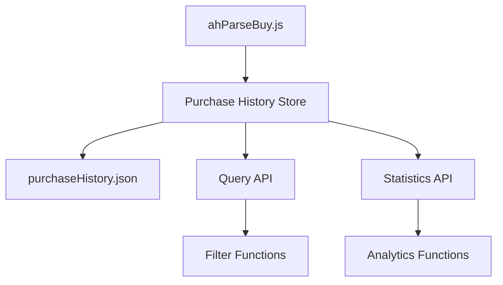

# Design Document

## Overview

Система истории покупок представляет собой модуль для отслеживания и анализа всех покупок, совершенных ботами на аукционе Minecraft. Система интегрируется с существующим кодом бота, автоматически записывает детали каждой покупки и предоставляет API для просмотра истории и получения статистики.

## Architecture

Система следует архитектурному паттерну существующих модулей (listedItemsStore, priceStore) и состоит из:

1. **Purchase History Store** - основной модуль для работы с историей покупок
2. **Integration Layer** - интеграция с функцией buyItem в ahParseBuy.js
3. **File Storage** - JSON файл для постоянного хранения данных
4. **API Layer** - функции для получения истории и статистики



## Components and Interfaces

### Purchase History Store Module

**Файл:** `agent/botapp/modules/purchaseHistory.js`

**Основные функции:**
- `recordPurchase(botUsername, purchaseData)` - записать покупку
- `getPurchaseHistory(botUsername, options)` - получить историю покупок
- `getPurchaseStatistics(botUsername, options)` - получить статистику
- `getAllPurchases(options)` - получить все покупки всех ботов

**Внутренние функции:**
- `readPurchaseHistoryFile()` - чтение файла истории
- `writePurchaseHistoryFile(data)` - запись файла истории
- `cleanupOldRecords(records, maxRecords)` - очистка старых записей

### Integration Layer

**Модификация:** `agent/botapp/modules/ahParseBuy.js`

Интеграция в функцию `buyItem()` для автоматической записи успешных покупок.

### File Storage

**Файл:** `agent/botapp/purchaseHistory.json`

**Структура:**
```json
{
  "botUsername1": [
    {
      "id": "uuid",
      "itemName": "diamond_sword",
      "count": 1,
      "totalPrice": 1000,
      "unitPrice": 1000,
      "seller": "PlayerName",
      "anNumber": "an212",
      "timestamp": 1640995200000,
      "nbtData": {...},
      "matchedTarget": {...}
    }
  ],
  "botUsername2": [...]
}
```

## Data Models

### Purchase Record

```javascript
{
  id: String,              // Уникальный идентификатор покупки (UUID)
  itemName: String,        // Название предмета
  count: Number,           // Количество предметов
  totalPrice: Number,      // Общая цена покупки
  unitPrice: Number,       // Цена за единицу
  seller: String,          // Имя продавца
  anNumber: String,        // Номер анархии (an212, an213, etc.)
  timestamp: Number,       // Временная метка (Unix timestamp)
  nbtData: Object,         // NBT данные предмета (опционально)
  matchedTarget: Object    // Информация о целевом предмете (опционально)
}
```

### Query Options

```javascript
{
  startDate: Number,       // Начальная дата (Unix timestamp)
  endDate: Number,         // Конечная дата (Unix timestamp)
  itemName: String,        // Фильтр по названию предмета
  minPrice: Number,        // Минимальная цена
  maxPrice: Number,        // Максимальная цена
  seller: String,          // Фильтр по продавцу
  anNumber: String,        // Фильтр по номеру анархии
  limit: Number,           // Лимит записей
  offset: Number           // Смещение для пагинации
}
```

### Statistics Result

```javascript
{
  totalPurchases: Number,          // Общее количество покупок
  totalSpent: Number,              // Общая потраченная сумма
  averagePrice: Number,            // Средняя цена покупки
  mostPurchasedItems: Array,       // Самые покупаемые предметы
  purchasesByPeriod: Object,       // Покупки по периодам
  purchasesByAN: Object            // Покупки по анархиям
}
```

## Correctness Properties

*A property is a characteristic or behavior that should hold true across all valid executions of a system-essentially, a formal statement about what the system should do. Properties serve as the bridge between human-readable specifications and machine-verifiable correctness guarantees.*

### Property 1: Purchase Recording Completeness
*For any* successful purchase, recording it should result in a stored record containing all required fields (itemName, count, totalPrice, unitPrice, seller, anNumber, timestamp, botUsername)
**Validates: Requirements 1.1, 1.2, 1.3, 1.4**

### Property 2: Data Persistence Round Trip
*For any* purchase record, storing it and then reloading the system should preserve the exact same record data
**Validates: Requirements 1.5**

### Property 3: Bot-Specific Filtering
*For any* bot username and set of purchase records, filtering by that bot should return only records belonging to that specific bot
**Validates: Requirements 2.1**

### Property 4: Time-Based Filtering Accuracy
*For any* time range and set of purchase records, filtering by that range should return only records with timestamps within the specified bounds
**Validates: Requirements 2.2**

### Property 5: Chronological Sorting Consistency
*For any* set of purchase records, querying the history should return records sorted by timestamp in ascending order
**Validates: Requirements 2.3**

### Property 6: Multi-Criteria Filtering Correctness
*For any* combination of filters (itemName, price range), the results should satisfy all specified criteria simultaneously
**Validates: Requirements 2.4, 2.5**

### Property 7: Statistical Calculation Accuracy
*For any* set of purchase records, the calculated statistics (total count, total spent) should match the sum of individual record values
**Validates: Requirements 3.1, 3.2**

### Property 8: Item Statistics Aggregation
*For any* set of purchase records, grouping by item name should produce accurate counts and average prices for each item
**Validates: Requirements 3.3, 3.4**

### Property 9: Temporal Statistics Grouping
*For any* set of purchase records and time period, grouping by that period should correctly categorize all records
**Validates: Requirements 3.5**

### Property 10: Concurrent Write Safety
*For any* sequence of concurrent purchase recordings, all records should be preserved without data corruption
**Validates: Requirements 4.1**

### Property 11: History Size Management
*For any* bot with more than 10000 purchase records, the system should maintain exactly 10000 records by removing the oldest ones
**Validates: Requirements 4.3, 4.4**

### Property 12: Error Handling Resilience
*For any* file system error during read/write operations, the system should handle it gracefully without crashing
**Validates: Requirements 4.5**

### Property 13: Automatic Purchase Detection
*For any* successful buyItem execution that triggers a "вы успешно купили" message, a corresponding purchase record should be automatically created
**Validates: Requirements 5.2**

## Error Handling

### File System Errors
- **Read Errors**: При ошибке чтения файла система возвращает пустую историю и логирует ошибку
- **Write Errors**: При ошибке записи система повторяет попытку до 3 раз с экспоненциальной задержкой
- **Permission Errors**: Система логирует ошибку и продолжает работу без сохранения

### Data Validation Errors
- **Invalid Purchase Data**: Отклонение записей с отсутствующими обязательными полями
- **Invalid Timestamps**: Автоматическая установка текущего времени для некорректных временных меток
- **Invalid Prices**: Отклонение записей с отрицательными или нулевыми ценами

### Integration Errors
- **Bot Context Missing**: Использование fallback значений для отсутствующих данных бота
- **Network Timeouts**: Graceful handling при недоступности внешних ресурсов

## Testing Strategy

### Dual Testing Approach
Система будет тестироваться с использованием двух дополняющих друг друга подходов:

**Unit Tests:**
- Тестирование конкретных примеров и граничных случаев
- Проверка обработки ошибок и исключительных ситуаций
- Тестирование интеграционных точек с существующими модулями
- Проверка корректности экспорта модуля

**Property-Based Tests:**
- Проверка универсальных свойств на множестве сгенерированных входных данных
- Каждый тест выполняется минимум 100 итераций для обеспечения надежности
- Использование библиотеки fast-check для JavaScript
- Каждый property test помечается комментарием с ссылкой на соответствующее свойство дизайна

**Property Test Configuration:**
- Минимум 100 итераций на каждый property test
- Формат тега: **Feature: purchase-history, Property {number}: {property_text}**
- Каждое свойство корректности реализуется отдельным property-based тестом

**Test Coverage:**
- Unit tests фокусируются на конкретных сценариях и edge cases
- Property tests обеспечивают комплексное покрытие через рандомизацию входных данных
- Совместно обеспечивают полное покрытие функциональности системы