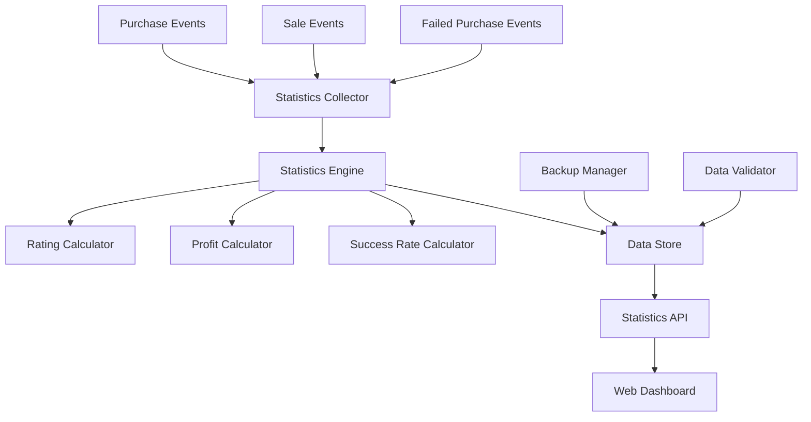

# Design Document: Purchase Statistics System

## Overview

Система статистики автобая представляет собой модульную архитектуру для сбора, анализа и отображения статистики покупок предметов. Система интегрируется с существующими модулями через события и предоставляет веб-интерфейс для просмотра аналитики.

## Architecture



Система состоит из следующих основных компонентов:
- **Statistics Collector**: Собирает события покупок, продаж и неудач
- **Statistics Engine**: Основной движок для обработки и агрегации данных
- **Rating Calculator**: Рассчитывает рейтинги предметов
- **Data Store**: Управляет персистентностью данных
- **Web Dashboard**: Веб-интерфейс для просмотра статистики

## Components and Interfaces

### Statistics Collector

Отвечает за сбор событий от других модулей системы.

```javascript
class StatisticsCollector {
    // Регистрирует покупку предмета
    recordPurchase(itemId, price, timestamp, details)
    
    // Регистрирует продажу предмета
    recordSale(itemId, salePrice, purchasePrice, timestamp)
    
    // Регистрирует неудачную попытку покупки
    recordMissedPurchase(itemId, reason, timestamp, attemptedPrice)
    
    // Инициализирует слушатели событий
    initializeEventListeners()
}
```

### Statistics Engine

Основной движок для обработки и агрегации статистических данных.

```javascript
class StatisticsEngine {
    // Получает статистику по предмету
    getItemStatistics(itemId)
    
    // Получает общую статистику
    getOverallStatistics()
    
    // Получает топ предметов по критерию
    getTopItems(criteria, limit)
    
    // Обновляет статистику при новом событии
    updateStatistics(event)
    
    // Получает статистику за период
    getStatisticsForPeriod(startDate, endDate)
}
```

### Rating Calculator

Рассчитывает рейтинги предметов на основе различных метрик.

```javascript
class RatingCalculator {
    // Рассчитывает общий рейтинг предмета (1-5 звезд)
    calculateItemRating(itemStats)
    
    // Рассчитывает коэффициент прибыльности
    calculateProfitabilityRatio(totalProfit, totalInvestment)
    
    // Рассчитывает показатель частоты покупок
    calculateFrequencyScore(purchaseCount, timeSpan)
    
    // Рассчитывает показатель успешности
    calculateSuccessScore(successfulPurchases, totalAttempts)
}
```

### Data Store

Управляет сохранением и загрузкой данных статистики.

```javascript
class StatisticsDataStore {
    // Сохраняет данные статистики
    saveStatistics(statistics)
    
    // Загружает данные статистики
    loadStatistics()
    
    // Создает резервную копию
    createBackup()
    
    // Восстанавливает из резервной копии
    restoreFromBackup()
    
    // Очищает устаревшие данные
    cleanupOldData(retentionDays)
}
```

## Data Models

### Purchase Record

```javascript
{
    id: "unique_purchase_id",
    itemId: "item_identifier",
    itemName: "display_name",
    itemDetails: {
        enchantments: [],
        attributes: {},
        rarity: "common|rare|epic|legendary"
    },
    purchasePrice: 1000,
    timestamp: "2026-01-10T12:00:00Z",
    source: "auction_house|bazaar"
}
```

### Sale Record

```javascript
{
    id: "unique_sale_id",
    purchaseId: "linked_purchase_id",
    itemId: "item_identifier",
    salePrice: 1500,
    profit: 500,
    profitMargin: 0.5,
    timestamp: "2026-01-10T14:00:00Z",
    holdingTime: 7200000 // milliseconds
}
```

### Missed Purchase Record

```javascript
{
    id: "unique_missed_id",
    itemId: "item_identifier",
    attemptedPrice: 800,
    reason: "already_sold|too_slow|insufficient_funds|other",
    timestamp: "2026-01-10T12:30:00Z",
    details: "additional_context"
}
```

### Item Statistics

```javascript
{
    itemId: "item_identifier",
    itemName: "display_name",
    totalPurchases: 15,
    totalSales: 12,
    totalProfit: 6000,
    averageProfit: 500,
    profitMargin: 0.4,
    successRate: 0.75, // successful purchases / total attempts
    rating: 4.2, // 1-5 stars
    missedPurchases: {
        total: 5,
        reasons: {
            "already_sold": 3,
            "too_slow": 2
        }
    },
    lastActivity: "2026-01-10T15:00:00Z"
}
```

## Correctness Properties

*A property is a characteristic or behavior that should hold true across all valid executions of a system-essentially, a formal statement about what the system should do. Properties serve as the bridge between human-readable specifications and machine-verifiable correctness guarantees.*

### Property 1: Event Recording Consistency
*For any* purchase, sale, or missed purchase event, when recorded by the system, all required fields should be correctly stored and retrievable
**Validates: Requirements 1.1, 1.3, 4.1, 4.2**

### Property 2: Statistics Aggregation Accuracy
*For any* set of purchase and sale records, the aggregated statistics (total purchases, total profit, success rate) should equal the sum/calculation of individual records
**Validates: Requirements 1.2, 2.2, 4.3, 4.5**

### Property 3: Mathematical Calculation Correctness
*For any* purchase-sale pair, the profit calculation should equal (sale_price - purchase_price), and profit margin should equal (profit / purchase_price)
**Validates: Requirements 2.1, 2.3, 2.4**

### Property 4: Rating Calculation Bounds and Consistency
*For any* item with statistics, the calculated rating should be between 1 and 5 stars and should increase when profitability or success rate increases
**Validates: Requirements 3.1, 3.2, 3.3**

### Property 5: Sorting and Ordering Correctness
*For any* list of items sorted by rating, each item's rating should be greater than or equal to the next item's rating
**Validates: Requirements 3.4**

### Property 6: Real-time Update Consistency
*For any* new purchase or sale event, the item's statistics and rating should be updated to reflect the new data
**Validates: Requirements 3.5, 5.5**

### Property 7: Data Persistence Round-trip
*For any* statistics data, saving then loading should produce equivalent data structures
**Validates: Requirements 6.1, 6.2**

### Property 8: Backup and Recovery Integrity
*For any* corrupted data scenario, the system should successfully restore from backup without data loss
**Validates: Requirements 6.3, 6.4**

### Property 9: Time-based Filtering Accuracy
*For any* time period filter, the returned statistics should only include events within that time range
**Validates: Requirements 5.4**

### Property 10: API Response Completeness
*For any* API request for item statistics, the response should contain all required fields (purchases, sales, profit, rating, missed purchases)
**Validates: Requirements 5.3, 7.4**

## Error Handling

### Data Corruption Recovery
- Система должна автоматически создавать резервные копии каждые 24 часа
- При обнаружении поврежденных данных система восстанавливается из последней валидной копии
- Все операции записи должны быть атомарными для предотвращения частичной записи

### Invalid Data Handling
- Отрицательные цены должны отклоняться с логированием ошибки
- Отсутствующие обязательные поля должны приводить к отклонению записи
- Дублирующиеся события должны игнорироваться на основе уникальных идентификаторов

### Performance Considerations
- Статистика должна рассчитываться инкрементально для избежания полного пересчета
- Старые данные (>90 дней) должны архивироваться для оптимизации производительности
- Кэширование часто запрашиваемых данных (топ предметы, общая статистика)

## Testing Strategy

### Unit Testing
Система будет тестироваться с помощью unit тестов для проверки:
- Корректности математических расчетов
- Валидации входных данных
- Обработки граничных случаев (пустые данные, экстремальные значения)
- Интеграции с существующими модулями

### Property-Based Testing
Система будет использовать property-based тестирование с библиотекой **fast-check** для JavaScript:
- Минимум 100 итераций на каждый property тест
- Каждый property тест должен ссылаться на соответствующее свойство из дизайна
- Формат тега: **Feature: purchase-statistics, Property {number}: {property_text}**

**Dual Testing Approach:**
- Unit тесты проверяют конкретные примеры и граничные случаи
- Property тесты проверяют универсальные свойства на множестве входных данных
- Оба типа тестов дополняют друг друга для обеспечения полного покрытия

**Property Test Configuration:**
- Каждое свойство корректности должно быть реализовано отдельным property-based тестом
- Тесты должны генерировать разнообразные входные данные (цены, временные метки, типы предметов)
- Генераторы должны создавать как валидные, так и граничные случаи данных