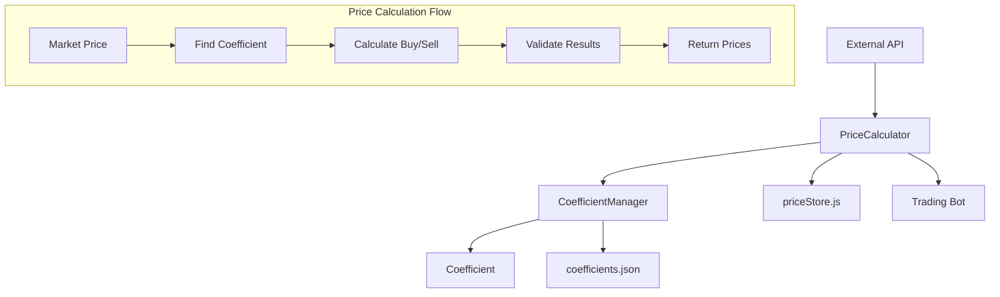

# Design Document

## Overview

Улучшенная система автоматического расчета цен заменит текущую упрощенную логику фиксированных коэффициентов (75% покупка / 95% продажа) на умную адаптивную систему с динамическими коэффициентами в зависимости от ценового диапазона. Система будет состоять из трех основных компонентов: Coefficient (коэффициент), CoefficientManager (менеджер коэффициентов) и улучшенного PriceCalculator.

## Architecture



Система использует паттерн Strategy для выбора коэффициентов и Factory для создания объектов расчета цен.

## Components and Interfaces

### Coefficient Class

```javascript
class Coefficient {
    constructor(name, description, minPrice, maxPrice, buyMultiplier, sellMultiplier)
    
    // Проверяет, подходит ли коэффициент для данной цены
    matches(price): boolean
    
    // Расчеты цен и прибыли
    calculateBuyPrice(marketPrice): number
    calculateSellPrice(marketPrice): number
    calculateProfit(marketPrice): number
    calculateProfitPercent(marketPrice): number
    
    // Геттеры
    getName(): string
    getDescription(): string
    getMinPrice(): number
    getMaxPrice(): number | null
    getBuyMultiplier(): number
    getSellMultiplier(): number
}
```

### CoefficientManager Class

```javascript
class CoefficientManager {
    // Singleton pattern
    static getInstance(): CoefficientManager
    
    // Управление коэффициентами
    loadCoefficients(): void
    saveCoefficients(): void
    resetToDefaults(): void
    
    // Поиск и управление
    findCoefficientForPrice(price): Coefficient | null
    getAllCoefficients(): Coefficient[]
    addCoefficient(coefficient): void
    removeCoefficient(coefficient): void
    
    // Валидация
    validateCoefficients(): boolean
    printDebugInfo(): void
}
```

### Enhanced PriceCalculator

```javascript
// Обновленная функция с обратной совместимостью
function computeSmartPrice(lots, historicalPrice): {
    absolutePrice: number,
    buyPrice: number, 
    sellPrice: number,
    coefficient?: string,
    profit?: number,
    profitPercent?: number
}

// Новая функция для расширенных расчетов
function calculatePricesWithCoefficients(marketPrice, itemName): {
    marketPrice: number,
    coefficient: Coefficient,
    buyPrice: number,
    sellPrice: number,
    profit: number,
    profitPercent: number
}
```

## Data Models

### Coefficient Data Structure

```javascript
{
    name: string,           // "Дешевые предметы"
    description: string,    // "Предметы до 1000 монет - высокий процент прибыли"
    minPrice: number,       // 0
    maxPrice: number|null,  // 1000 или null для открытого диапазона
    buyMultiplier: number,  // 0.70 (70%)
    sellMultiplier: number  // 1.40 (140%)
}
```

### Default Coefficients Configuration

```javascript
const DEFAULT_COEFFICIENTS = [
    {
        name: "Дешевые предметы",
        description: "Предметы до 1000 монет - высокий процент прибыли",
        minPrice: 0,
        maxPrice: 1000,
        buyMultiplier: 0.70,
        sellMultiplier: 1.40
    },
    {
        name: "Средние предметы", 
        description: "Предметы 1000-10000 монет - умеренная прибыль",
        minPrice: 1000,
        maxPrice: 10000,
        buyMultiplier: 0.75,
        sellMultiplier: 1.25
    },
    {
        name: "Дорогие предметы",
        description: "Предметы 10000-100000 монет - стабильная прибыль", 
        minPrice: 10000,
        maxPrice: 100000,
        buyMultiplier: 0.80,
        sellMultiplier: 1.20
    },
    {
        name: "Очень дорогие предметы",
        description: "Предметы 100000-1000000 монет - консервативная торговля",
        minPrice: 100000,
        maxPrice: 1000000,
        buyMultiplier: 0.85,
        sellMultiplier: 1.15
    },
    {
        name: "Элитные предметы",
        description: "Предметы свыше 1000000 монет - минимальный риск",
        minPrice: 1000000,
        maxPrice: null,
        buyMultiplier: 0.90,
        sellMultiplier: 1.10
    }
];
```

### Price Calculation Result

```javascript
{
    absolutePrice: number,     // Рыночная цена
    buyPrice: number,          // Цена покупки
    sellPrice: number,         // Цена продажи
    coefficient?: string,      // Название использованного коэффициента
    profit?: number,           // Ожидаемая прибыль
    profitPercent?: number     // Процент прибыли
}
```

## Correctness Properties

*A property is a characteristic or behavior that should hold true across all valid executions of a system-essentially, a formal statement about what the system should do. Properties serve as the bridge between human-readable specifications and machine-verifiable correctness guarantees.*

### Property 1: Coefficient Selection by Price Range
*For any* market price, the Price_Calculator should select the coefficient whose price range contains that price, and the selected coefficient should have the expected multipliers for that range.
**Validates: Requirements 1.1, 1.2, 1.3, 1.4, 1.5**

### Property 2: Mathematical Calculation Correctness  
*For any* market price and coefficient, the calculated buy price should equal floor(market_price * buy_multiplier), sell price should equal floor(market_price * sell_multiplier), profit should equal sell_price - buy_price, and profit percentage should equal (profit / buy_price) * 100.
**Validates: Requirements 2.4, 2.5, 2.6, 2.7**

### Property 3: Coefficient Persistence Round Trip
*For any* valid coefficient configuration, saving then loading the coefficients should produce an equivalent configuration.
**Validates: Requirements 3.1, 3.5**

### Property 4: Input Processing Consistency
*For any* lots array with valid prices, the Price_Calculator should extract the minimum unit price and return an object with absolutePrice, buyPrice, and sellPrice properties.
**Validates: Requirements 4.2, 4.4**

### Property 5: Business Rule Invariant
*For any* valid price calculation result, the buy price should be less than the sell price (buy_price < sell_price).
**Validates: Requirements 5.4**

### Property 6: Coefficient Uniqueness
*For any* price, at most one coefficient should match that price (no overlapping ranges).
**Validates: Requirements 2.3**

### Property 7: Error Recovery Consistency
*For any* invalid input or calculation error, the Price_Calculator should return safe fallback values that maintain the business rule invariant.
**Validates: Requirements 5.2**

### Property 8: Cache Consistency
*For any* coefficient update operation, subsequent coefficient lookups should immediately reflect the changes.
**Validates: Requirements 6.3**

### Property 9: Coefficient Validation
*For any* coefficient data loaded from file, invalid coefficients should be rejected and the system should fall back to valid defaults.
**Validates: Requirements 3.2**

### Property 10: API Compatibility
*For any* input that was valid for computeSimplePrice, the new computeSmartPrice should return a compatible result structure.
**Validates: Requirements 4.1**

## Error Handling

### Input Validation
- **Invalid Market Prices**: Prices ≤ 0 trigger historical price fallback
- **Missing Historical Data**: Use safe default values (1000 coins base price)
- **Invalid Lots Array**: Empty or malformed arrays use historical price fallback
- **Coefficient Matching Failure**: Use legacy multipliers (0.75 buy, 0.95 sell)

### Configuration Errors
- **Missing Config File**: Auto-create default coefficients
- **Corrupted Config**: Reset to defaults and log warning
- **Invalid Coefficient Data**: Skip invalid entries, use remaining valid coefficients
- **Overlapping Ranges**: Log warning, use first matching coefficient

### Calculation Errors
- **Division by Zero**: Return safe fallback values
- **Negative Profit**: Log warning but allow (market conditions may require)
- **Extreme Values**: Cap calculations at reasonable limits (1-100M coins)
- **Floating Point Precision**: Always round to integers for final prices

### Recovery Strategies
- **Graceful Degradation**: Fall back to simple calculation when smart calculation fails
- **Logging**: Record all errors for debugging without breaking execution
- **Validation**: Ensure buy_price < sell_price invariant is maintained
- **Retry Logic**: Attempt coefficient reload on persistent errors

## Testing Strategy

### Dual Testing Approach
The system will use both unit tests and property-based tests for comprehensive coverage:

**Unit Tests** focus on:
- Specific coefficient configurations and edge cases
- Error handling scenarios with known inputs
- Integration points between components
- Configuration file loading and saving

**Property-Based Tests** focus on:
- Universal properties across all price ranges
- Mathematical correctness of calculations
- Round-trip properties for persistence
- Invariant maintenance across all operations

### Property-Based Testing Configuration
- **Framework**: Use fast-check library for JavaScript property testing
- **Iterations**: Minimum 100 iterations per property test
- **Test Tagging**: Each property test references its design document property
- **Tag Format**: `Feature: smart-price-calculator, Property {number}: {property_text}`

### Test Categories

#### Mathematical Properties
- Coefficient selection correctness across all price ranges
- Calculation accuracy for buy/sell prices and profit margins
- Business rule invariants (buy < sell price)

#### Persistence Properties  
- Configuration save/load round-trip integrity
- Coefficient export/import consistency
- Cache update propagation

#### Error Handling Properties
- Graceful degradation with invalid inputs
- Fallback value safety and correctness
- Recovery from configuration errors

#### Compatibility Properties
- API backward compatibility with existing code
- Input/output format consistency
- Integration with existing price store

### Performance Testing
- Coefficient lookup performance with large datasets
- Memory usage with extensive coefficient configurations
- File I/O efficiency for configuration operations